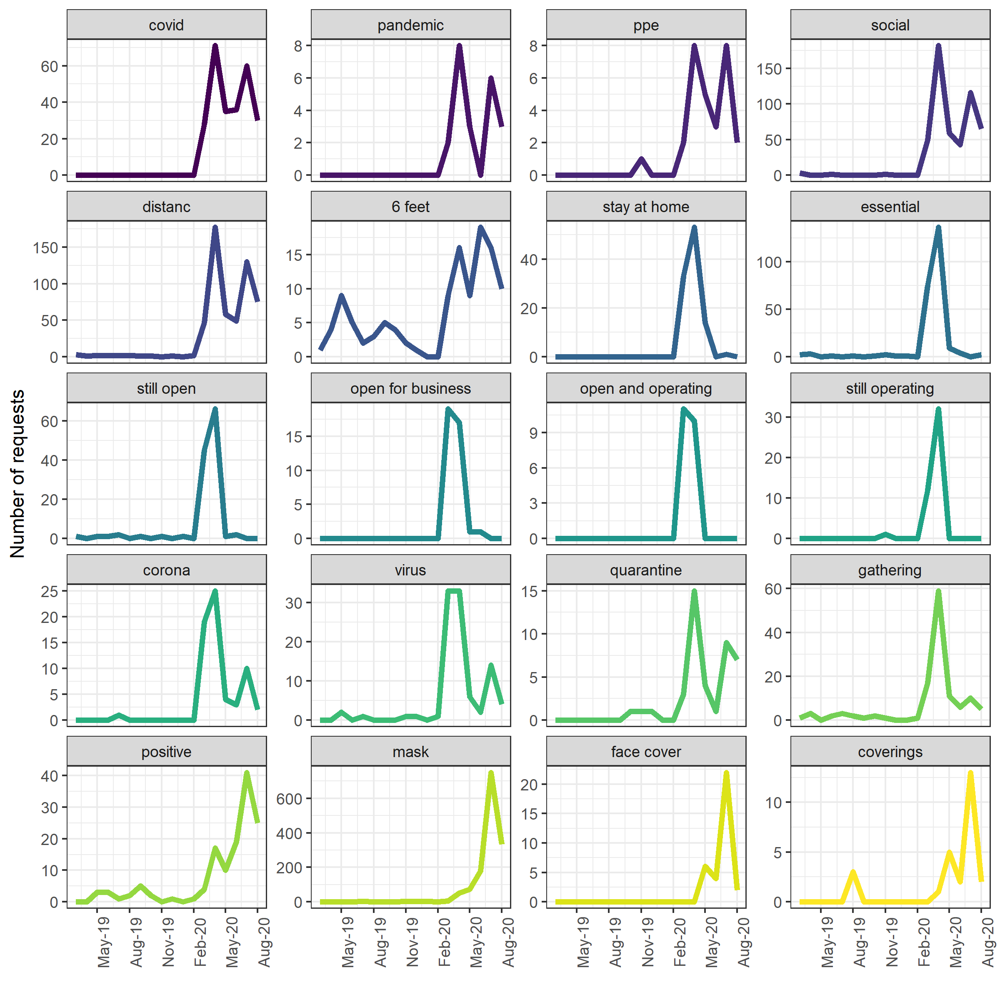
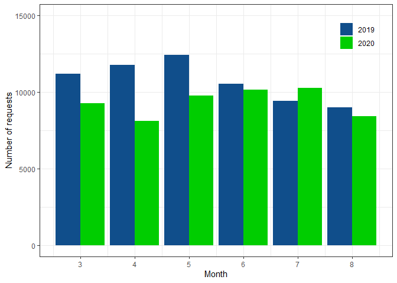
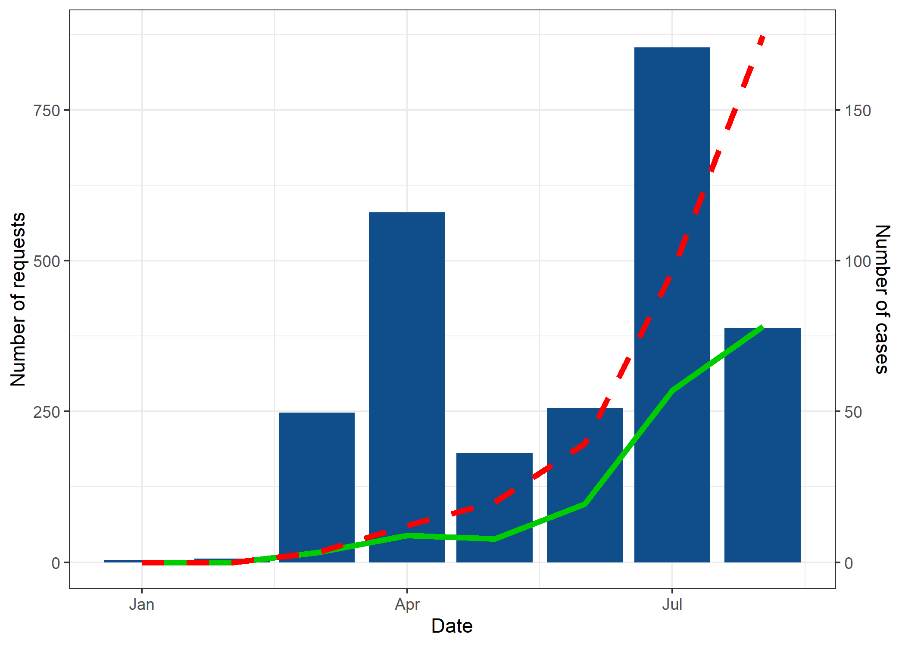
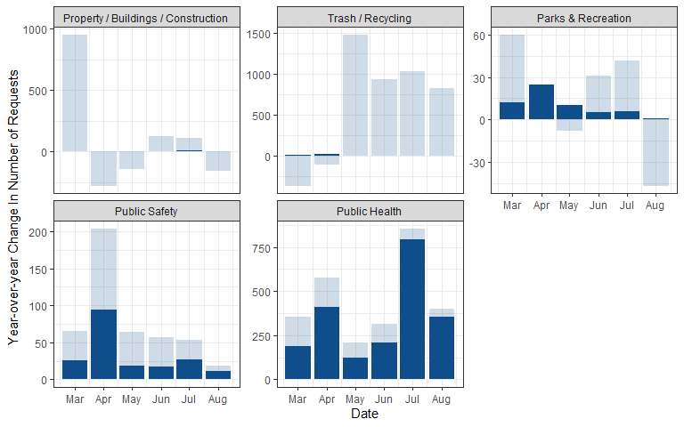

Non-Emergency Responses in the 311 System During the Early Stage of the
Pandemic: A Case Study of Kansas City
================

**Abstract**

In response to the widespread of COVID-19, citizens sought information
and support from their city governance through the 311 non-emergency
service request system. Our analysis showed that the pandemic has led to
a considerable decline in the aggregate number of 311 calls in Kansas
City; however, “Public Safety”, “Public Health”, “Trash/Recycling”,
“Parks & Recreation”, and “Property / Buildings / Construction”
experienced substantial increase in call volume. In order to explore
whether these changes are driven by covid-related service requests, we
use the description text data and identify 2,379 requests related to the
pandemic, accounting for 4.3 percent of all non-emergency requests in
Kansas City between March and August of 2020. More than half of
covid-related requests reported mask violations where people fail to
wear masks or do not wear masks properly. Compared to non-covid-related
requests, citizens were more likely to seek non-emergency services
through phone and email and less likely to use the web as means of
communication. In addition, the majority of changes in “Public Safety”
and “Public Health” request volumes were driven by these covid-related
requests.

**Figures**

Figure 1: Monthly number of requests containing COVID-19-related
keywords in 2019-2020

<!-- -->

Figure 2: Number of requests during March-August in 2019 versus 2020

<!-- -->

Figure 3: Number of covid-related requests (green, left axis) vs
COVID-19 new cases (blue, right axis) in 2020

<!-- -->

Figure 4: Year-over-year change in covid-related requests (darker blue)
vs year-over-year change in total requests (lighter blue) by category
from March to August 2020

    ## Using n as value column: use value.var to override.

    ## `summarise()` has grouped output by 'CATEGORY', 'CREATEMO'. You can override using the `.groups` argument.

<!-- -->

Words Association Graph

    ## Warning: Ignoring unknown parameters: size

<!-- -->
