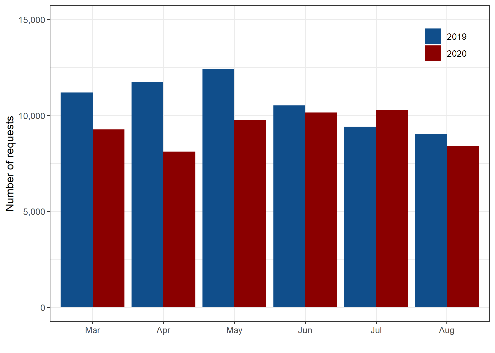
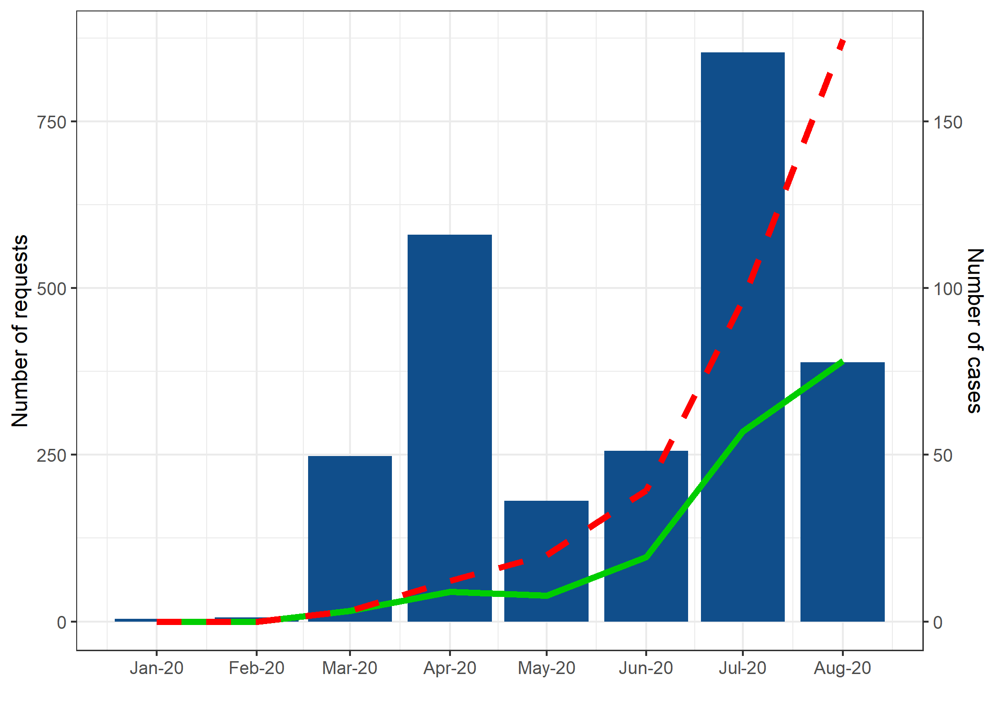
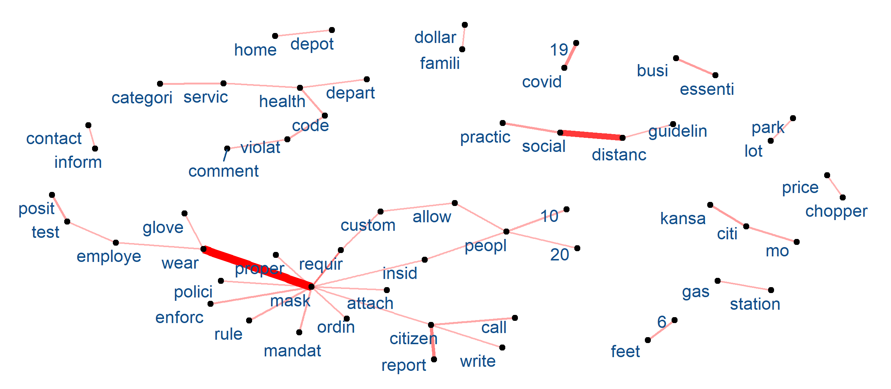

Non-Emergency Responses in the 311 System During the Early Stage of the
Pandemic: A Case Study of Kansas City
================

**Abstract**

In response to the COVID-19 pandemic, many U.S. citizens sought
information and support from their city governance through the 311
non-emergency service request system. The main purpose of this study was
to analyze the temporal trends in the 311 data before and during the
first few months of the COVID-19 pandemic (3/1/2019 to 9/1/2020). Like
other major U.S. cities such as Dallas and New York City, analysis of
Kansas City 311 data showed that the COVID-19 pandemic has led to a
considerable decline in the aggregate number of calls. However, five
service categories (“Public Safety”, “Public Health”, “Trash/Recycling”,
“Parks & Recreation”, and “Property / Buildings / Construction”)
experienced a substantial increase in call volume. To explore whether
these changes are driven by COVID-related service requests, we used the
description text data and identified 2,379 requests related to the
pandemic, accounting for 4.3 percent of all non-emergency requests in
Kansas City between March and August of 2020. More than half of the
COVID-related requests reported mask violations where people failed to
wear masks or did not wear masks properly. Compared to the
non-COVID-related requests, citizens were more likely to seek
non-emergency services through phone and email and less likely to use
the web as means of communication. In addition, most changes in “Public
Safety” and “Public Health” request volumes were driven by these
COVID-related requests. These results can help city officials and
decision makers improve the city’s resilience by allocating resources
for the above-mentioned five service categories during a pandemic. In
conclusion, analysis of open-access 311 data can be a catalyst for local
governments to quickly and properly respond and build long-term
resilience against future pandemics and other health threats.

**Figures**

Figure 1: Monthly number of requests containing COVID-19-related
keywords in 2019-2020

    ## Warning: Using `size` aesthetic for lines was deprecated in ggplot2 3.4.0.
    ## ℹ Please use `linewidth` instead.

<!-- -->

Figure 2: Number of requests during March-August in 2019 versus 2020

<!-- -->

Figure 3: Number of covid-related requests (green, left axis) vs
COVID-19 new cases (blue, right axis) in 2020

<!-- -->

Figure 4: Words Association Graph

    ## Warning: Using the `size` aesthetic in this geom was deprecated in ggplot2 3.4.0.
    ## ℹ Please use `linewidth` in the `default_aes` field and elsewhere instead.

<!-- -->

Figure 5: Year-over-year change in covid-related requests (darker blue)
vs year-over-year change in total requests (lighter blue) by category
from March to August 2020

    ## Using n as value column: use value.var to override.

    ## `summarise()` has grouped output by 'CATEGORY', 'CREATEMO'. You can override
    ## using the `.groups` argument.

<!-- -->
